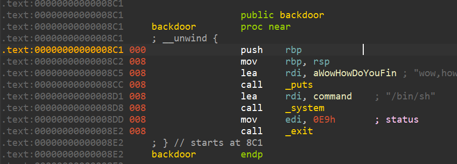
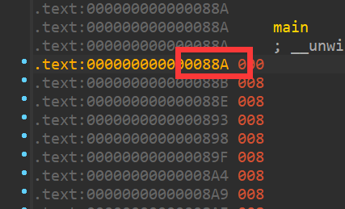
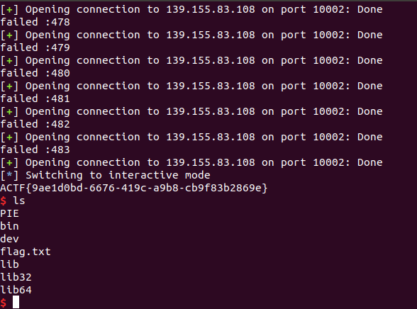

# PIE

这个题我给错输入函数了。原本是只给了一个read，打算让泄露返回地址来打ret2text。结果给成了带有截断的gets，导致输出末尾有一个字节的\x00覆写，从而变成了1/4096的爆破题。

名字叫PIE，可能很多人下意识第一步一定要泄露地址。事实上没这个必要。

首先题目中给了backdoor，内存页内地址为0x8c1

由于vulunable函数的返回地址是main（0x88a），和backdoor位于同一内存页内。

所以我们只需要将返回地址的低2字节复写为0xY8c1即可（Y为任意数字）

gets会多写一个\x00？

没关系，反正PIE地址随机，爆它就完事了

爆破是真能成的，写个脚本挂机爆就行了。

