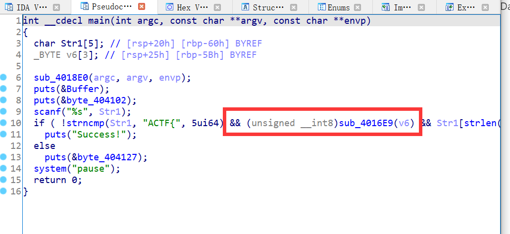
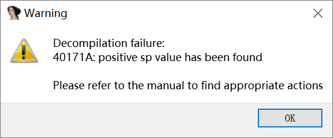
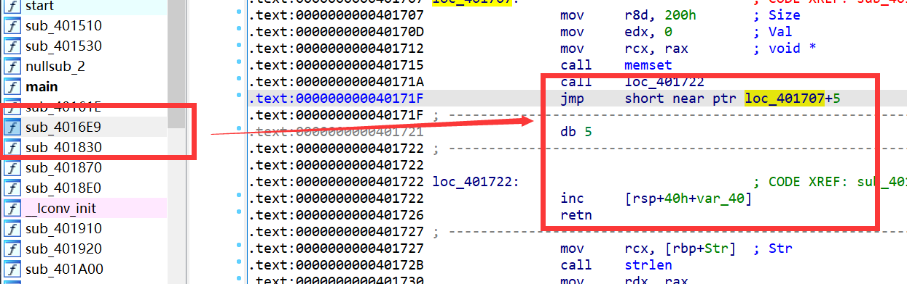
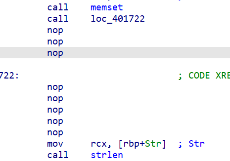
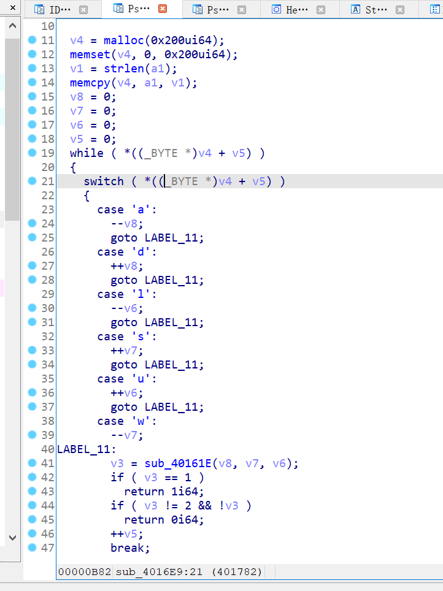
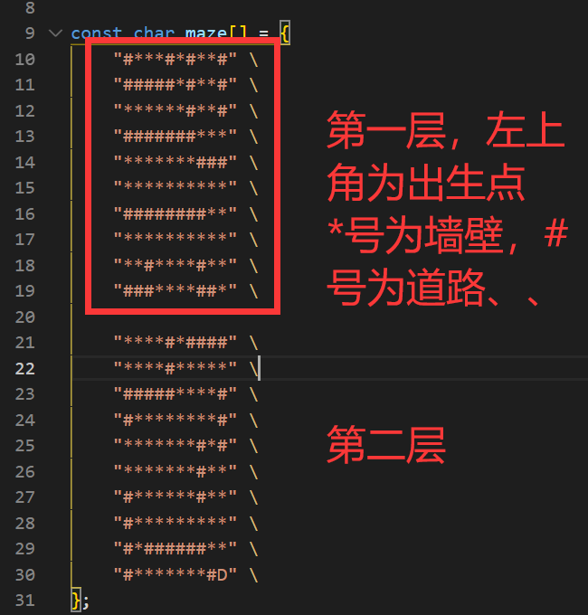
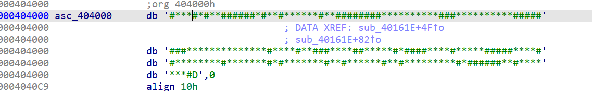
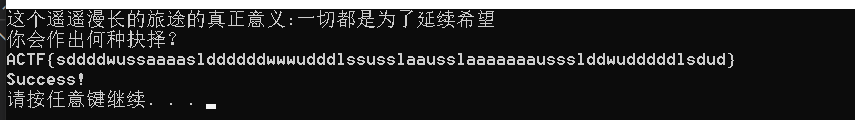

# Daisy

`ACTF{sddddwussaaaaslddddddwwwudddlssusslaausslaaaaaaaussslddwudddddlsdud}`

## 解题思路

用ida打开后，反编译main函数

红框中的函数无法反编译。

在左侧函数列表中找到该函数，于汇编窗口中查看病灶

发现花指令，干扰了反编译器。

左上角：edit->patch program->assemble

填入`nop`,把红框中的指令全部覆盖掉

之后即可正常反编译。

接着是逆向。捋清楚程序逻辑之后可以发现这是一个迷宫题。

玩家出生在0，0，0这个坐标，迷宫高2层，长宽都是10。

目标是走到迷宫的D点

可能需要一些预处理。不过用python也好，用C语言也好，这种字符串处理对于程序员而言十分简单。

捋清楚路径之后，输入ACTF{路径}，就可以看到success字样

