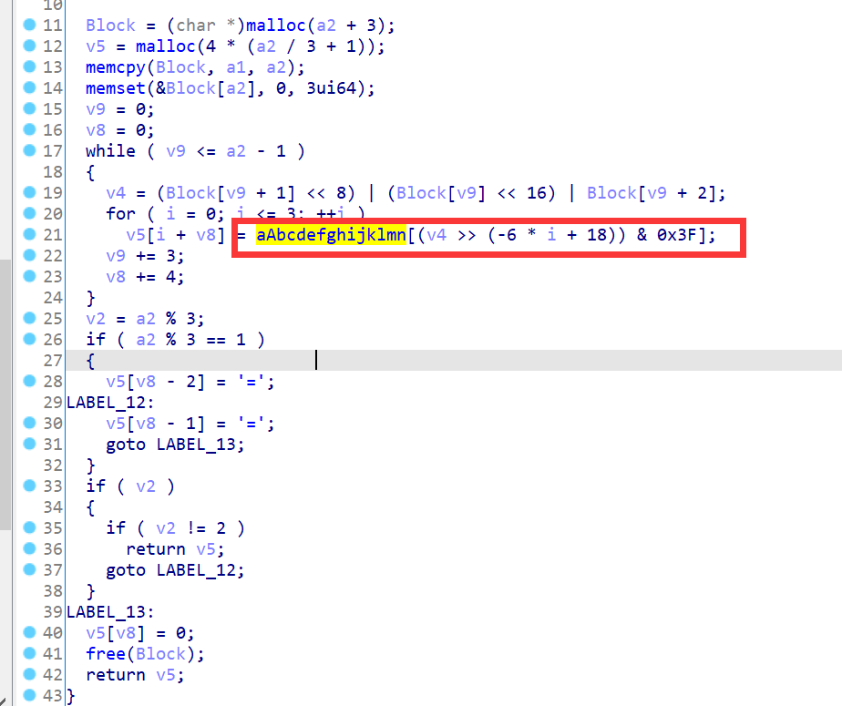

# How2base64decode

`ACTF{Base64_is_a_tradional_coding_algorithm}`

用ida打开后，反编译main函数

发现图中红框处的加密函数调用


双击点进去查看，可见base64码表和熟悉的&0x3f



问：为什么通过这一点就确定是base64？

答：ctf是开放式的比赛，善用百度有时候能解决很多问题，然后学到很多新知识


然后搜索base64解码工具，进行base64解码即可

或者用python的base64库

```python
import base64

print(base64.b64decode(b"QUNURntCYXNlNjRfaXNfYV90cmFkaW9uYWxfY29kaW5nX2FsZ29yaXRobX0="))
```

