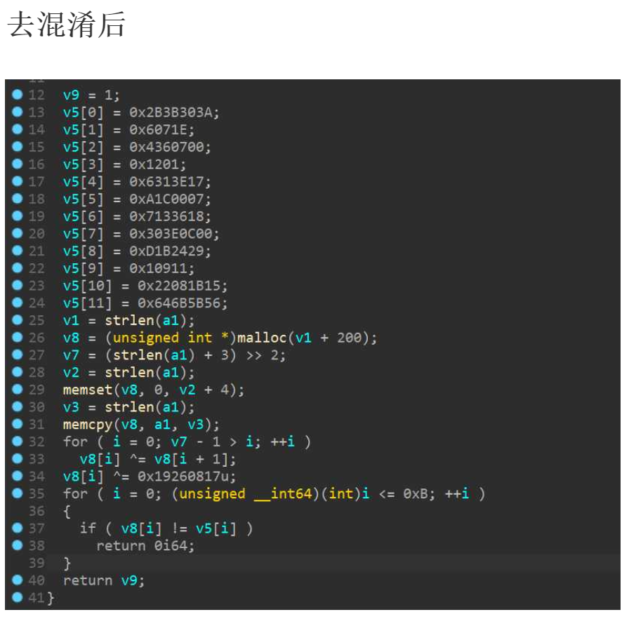

# Daisy

`ACTF{sometimes_ida_is_not_reliable_READ_THE_ASM}`

## 解题思路

这个题目是临时加的。刚好在学习ida的MacroCode API，就手写了一个类似混淆的玩意出来。

预期解很多，比如说硬逆+化简表达式；符号执行……

我只介绍和MacroCode API相关的一种思路

```c
static unsigned int x = 0x114514;
static unsigned int y = 0x1919810;
#define NOT(a) (a ^ y)
#define IS(a)  (a ^ x)
#define XOR(a,b) ((a&NOT(b))|(NOT(a)&b))
__attribute__((constructor)) void init_const(){
    x = 0;
    y = 0xffffffff;
}
```

### \_\_attribute\_\_((constructor))

理解为在main函数之前执行就行。Gstalker出题常见套路之一。

内容很简单，设置x为0，设置y为0xffffffff

### 与或非的无限可能性

混淆是啥？

说白了就是往代码里头搞点事情，**在不干扰原程序正常运行情况下**，增大程序的逆向工程难度。常见手段为**插入冗余代码**或者**表达式等效替换**

本题只使用了后面的手段。

`#define NOT(a) (a ^ y)`

0xffffffff异或任何无符号DWORD，则为取反。等效为\~a

`#define IS(a)  (a ^ x)`

0x0000000异或任何无符号DWORD，无效果。等效为a

`#define XOR(a,b) ((a&NOT(b))|(NOT(a)&b))`

a & ~b | ~a & b 等效为a ^ b

具体推理方法请参考逻辑代数等计算机基础课程。

### IDA MacroCode API在去混淆和去平坦化的无限可能性

**MacroCode API是什么**

类似llvm的中间语言优化，ida的在进行反编译时，也存在一个用**于优化的中间语言**——Macrocode
MacroCode API位于IDA SDK的ida_hexrays.hpp中。idapython也为其提供了较为全面的参数（但是文档狗屁不通，全靠试错学习法）
学习Ida Macrocode，可以从idapython目录下的examples出发。
推荐阅读`{idaPATH}\python\examples\hexrays`目录下的vsd19.py，并结合vds13.py进行相关学习。

**中间语言？思路如何？**

想要理解后面的内容，需要一点编译原理的基础。只需要理解什么是编译的“词”和“语句”即可

ida的核心功能有2，一是反汇编和二进制数据分类整理。二是反编译器。

反汇编和反编译这两个概念是很多二进制安全新手混淆的概念。

反汇编仅仅是把二进制数据还原成汇编指令。这很好理解，也很容易做到。

而反编译，则是在反汇编的基础之上，根据反汇编的结果，重新推算语义数据，并更具语义数据推算出伪C代码。也就是ida 的钛合金F5的功能。

ida反编译的流程如下：

1. 将反汇编得到的汇编代码逐条转化为MacroCode。 注意，MacroCode是一种中间语言，他的规则和反汇编不同。详情请见https://gist.github.com/trietptm/be777409240c16dbdeea7ec651e5b9d1

   一条汇编语句可能对应4条以上的MacroCode。最初版的Macrocode体积十分庞大，但是也十分详细。

2. 生成CFG，优化，不断的优化。去重，去无用代码块，将MacroCode尽可能优化
3. 根据MacroCode生成CTree(IDA的另一个反编译模块，同样具有去混淆和去平坦化的功能，但是没有MacroCode API翻遍)
4. 更具CTree生成为C代码，反编译结束

那么我们如何利用MacroCode API进行反混淆？

替换即可。

每一条MacroCode的语句(minsn_t)都有三种操作数：l（被操作数）,r(施加数）,d（运算结果去向）

打个比方，语句c =  a ^ b的结构为

```python
ins = curins.ins
print(ins.l == a)# True
print(ins.r == b)# True
print(ins.d == c)# True
```

如果b是已知的0xffffffff，那么我们可以得知c = ~a

我们可以在替换脚本中这么替换：

```python
ins.opcode = ida_hexrays.m_xor
ins.l = a # 不变
ins.r = ida_hexrays.mop_t() #空操作数
```

写好之后，把脚本丢到ida的插件文件夹里头，重启ida，反编译一次，即可看到很明显的效果

图片来源：http://dreamstalker.cn/index.php/2021/03/02/macrocode_result/




## 脚本使用方法

将下面这个python脚本放在`{idaPATH}\plugins`下，然后重启ida即可生效
仅适用于ida7.5
该脚本中的表达式识别并不严谨，仅适用于这个文件。

```python
import ida_hexrays
import ida_idaapi

class mop_t_extractor():
    @staticmethod
    def type_cmp(tar : ida_hexrays.mop_t,t) -> bool:
        return tar.t == t
    @staticmethod
    def op_cmp(mop : ida_hexrays.mop_t,tar) -> bool:
        if mop.t != ida_hexrays.mop_d:
            return False
        if mop.d.opcode != tar:
            return False
        return True
    @staticmethod
    def get_tar(target : ida_hexrays.mop_t = None):
        if target is None:
            raise RuntimeError("No target specified")
        m_type = target.t
        if m_type == ida_hexrays.mop_z:
            return None
        elif m_type == ida_hexrays.mop_r:
            return target.r
        elif m_type == ida_hexrays.mop_n:
            return target.nnn
        elif m_type == ida_hexrays.mop_str:
            return target.cstr
        elif m_type == ida_hexrays.mop_d:
            return target.d
        elif m_type == ida_hexrays.mop_S:
            return target.s
        elif m_type == ida_hexrays.mop_v:
            return target.g
        elif m_type == ida_hexrays.mop_b:
            return target.b
        elif m_type == ida_hexrays.mop_f:
            return target.f
        elif m_type == ida_hexrays.mop_l:
            return target.l
        elif m_type == ida_hexrays.mop_a:
            return target.a
        elif m_type == ida_hexrays.mop_h:
            return target.helper
        elif m_type == ida_hexrays.mop_c:
            return target.c
        elif m_type == ida_hexrays.mop_fn:
            return target.fpc
        elif m_type == ida_hexrays.mop_p:
            return target.pair
        elif m_type == ida_hexrays.mop_sc:
            return target.scif
class subinsn_optimizer_t(ida_hexrays.minsn_visitor_t):
    cnt = 0
    def visit_minsn(self):
        ins = self.curins
        if ins.opcode == ida_hexrays.m_xor:
            if  ins.l.t == ida_hexrays.mop_v and ins.l.g == 0x404010 and not ins.l.has_side_effects():
                ins.l.make_number(0,ins.r.size)
                self.cnt = self.cnt + 1
                print("is insn detected")
            elif ins.l.r == ida_hexrays.mop_v and ins.r.g == 0x404010 and not ins.r.has_side_effects():
                ins.r.make_number(0,ins.l.size)
                self.cnt = self.cnt + 1
                print("IS insn detected")
            elif ins.l.t == ida_hexrays.mop_v and ins.l.g == 0x404014 and not ins.l.has_side_effects():
                ins.opcode = ida_hexrays.m_bnot
                ins.l = ins.r
                ins.r = ida_hexrays.mop_t()
                self.cnt = self.cnt + 1
                print("not insn detected")
            elif ins.r.t == ida_hexrays.mop_v and ins.r.g == 0x404014 and not ins.r.has_side_effects():
                ins.opcode = ida_hexrays.m_bnot
                ins.r = ida_hexrays.mop_t()
                self.cnt = self.cnt + 1
                print("NOT insn detected")
        # 识别 ~a & b | a & ~b
        elif ins.opcode == ida_hexrays.m_or \
            and mop_t_extractor.op_cmp(ins.l,ida_hexrays.m_and) \
            and mop_t_extractor.op_cmp(ins.r,ida_hexrays.m_and):
            left_and = ins.l.d
            right_and = ins.r.d
            a = left_and.l
            b = left_and.r
            c = right_and.l
            d = right_and.r
            print("XOR insn detected")
            print(a.t)
            if(a.t == 4):
                print("    ",a.d.opcode)
            print(b.t)
            if(b.t == 4):
                print("    ",b.d.opcode)
            print(c.t)
            if(c.t == 4):
                print("    ",c.d.opcode)
            print(d.t)
            if(d.t == 4):
                print("    ",d.d.opcode)
            if a == None or b == None or c == None or d == None:
                return 0
            if a.t == ida_hexrays.mop_d \
               and a.d.opcode == ida_hexrays.m_bnot \
               and b.t == ida_hexrays.mop_d \
               and b.d.opcode == ida_hexrays.m_ldx \
               and c.t == ida_hexrays.mop_d \
               and c.d.opcode == ida_hexrays.m_bnot \
               and d.t == ida_hexrays.mop_d \
               and d.d.opcode == ida_hexrays.m_ldx:
                print("XOR insn detected(type:1)")
                ins.opcode = ida_hexrays.m_xor
                ins.l = ida_hexrays.mop_t(b)
                ins.r = ida_hexrays.mop_t(d)
                self.cnt += 1
            elif a.t == ida_hexrays.mop_d \
               and b.t == ida_hexrays.mop_n \
               and c.t == ida_hexrays.mop_d \
               and d.t == ida_hexrays.mop_n \
               and c.d.opcode == ida_hexrays.m_bnot \
               and b.nnn.value == (~d.nnn.value)%0x100000000:
                print("XOR insn detected(type:2)")
                ins.opcode = ida_hexrays.m_xor
                ins.l = ida_hexrays.mop_t(a)
                ins.r = ida_hexrays.mop_t(d)
                self.cnt += 1
            elif a.t == ida_hexrays.mop_d \
               and a.d.opcode == ida_hexrays.m_bnot \
               and b.t == ida_hexrays.mop_d \
               and b.d.opcode == ida_hexrays.m_ldx \
               and c.t == ida_hexrays.mop_d \
               and c.d.opcode == ida_hexrays.m_ldx \
               and d.t == ida_hexrays.mop_d \
               and d.d.opcode == ida_hexrays.m_bnot:
                print("XOR insn detected(type:3)")
                ins.opcode = ida_hexrays.m_xor
                ins.l = ida_hexrays.mop_t(b)
                ins.r = ida_hexrays.mop_t(c)
                self.cnt += 1
        return 0
# a custom instruction optimizer, boilerplate code
class sample_optimizer_t(ida_hexrays.optinsn_t):
    def func(self, blk, ins, optflags):
        opt = subinsn_optimizer_t()
        ins.for_all_insns(opt)
        if opt.cnt != 0:                # if we modified microcode,
            blk.mba.verify(True)        # run the verifier
        return opt.cnt                  # report the number of changes

# a plugin interface, boilerplate code
class my_plugin_t(ida_idaapi.plugin_t):
    flags = ida_idaapi.PLUGIN_HIDE
    wanted_name = "optimize x|~x"
    wanted_hotkey = ""
    comment = ""
    help = ""
    def init(self):
        if ida_hexrays.init_hexrays_plugin():
            self.optimizer = sample_optimizer_t()
            self.optimizer.install()
            print("Installed sample optimizer for 'x | ~x'")
            return ida_idaapi.PLUGIN_KEEP # keep us in the memory
    def term(self):
        self.optimizer.remove()
    def run(self, arg):
        if arg == 1:
            return self.optimizer.remove()
        elif arg == 2:
            return self.optimizer.install()

def PLUGIN_ENTRY():
    return my_plugin_t()
```

