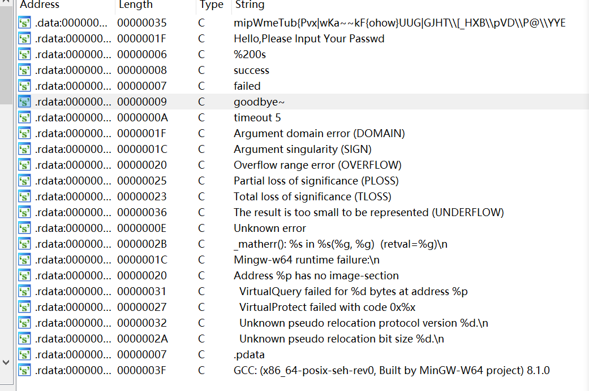
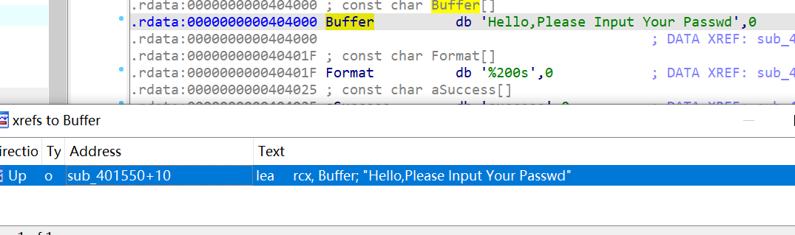
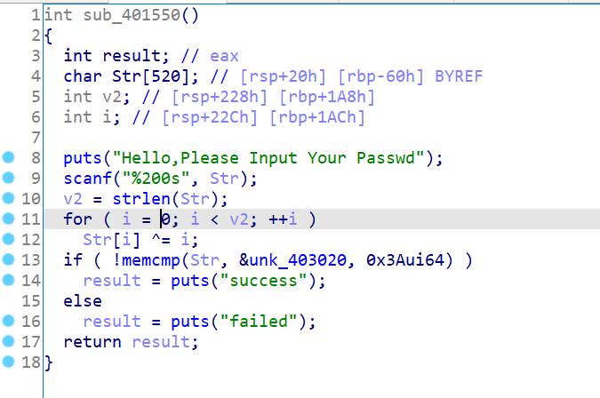

# How2idaXref

`ACTF{how_do_you_find_this_attribute_constructor_function}`

## 解题思路

ida解析文件后，按下shift+f12找字符串



很明显，有几个没有在主函数出现且又特殊含义的字符串。点过去，选中字符串，然后按下ctrl+x查找交叉引用



即可找到验证函数



简单算法，剩余步骤略。

## exp

```python
"""
for i in range(0x403020 , 0x403059):
    print(hex(get_wide_byte(i)),end = ',')
"""
enc = [0x41,0x42,0x56,0x45,0x7f,0x6d,0x69,0x70,0x57,0x6d,0x65,0x54,0x75,0x62,0x7b,0x50,0x76,0x78,0x7c,0x77,0x4b,0x61,0x7e,0x7e,0x6b,0x46,0x7b,0x6f,0x68,0x6f,0x77,0x7d,0x55,0x55,0x47,0x7c,0x47,0x4a,0x48,0x54,0x5c,0x5b,0x5f,0x48,0x58,0x42,0x5c,0x70,0x56,0x44,0x5c,0x50,0x40,0x5c,0x59,0x59,0x45]
for i in range(len(enc)):
    print(chr(enc[i]^i),end = '')
```

