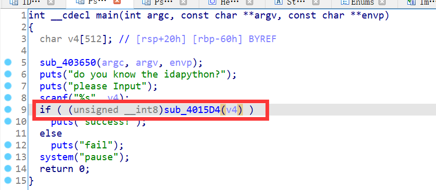
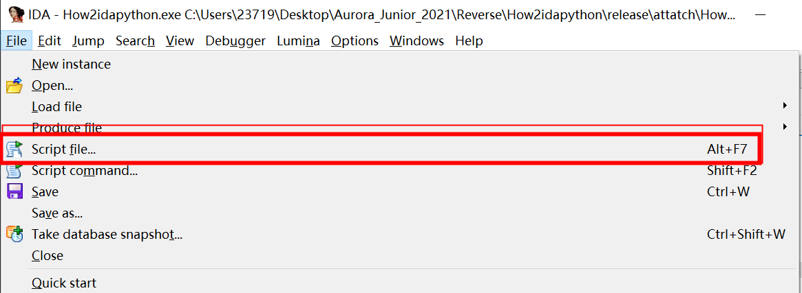
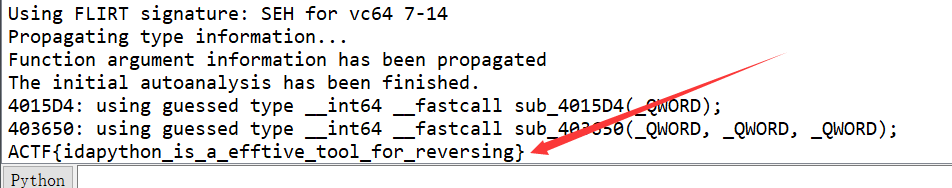

# How2idapython

`ACTF{idapython_is_a_efftive_tool_for_reversing}`

## 注意：本题存在多种解法

angr符号执行，z3约束求解都可行。

不过这里介绍一种新的解决方案：idapython

## 解题思路

用ida打开后，反编译main函数

发现图中红框处的加密函



这个函数的反编译结果就不放了。

idapython常用接口连接：https://wiki.csuaurora.org/2021/01/01/idapython3/

我们可以发现这一大段代码是十分规律的,其规律如下面的代码块。

```asm
mov al,[rbx+offset]
add al,rand()
mov [rbx+offset],al
```
我们可以通过idapython的接口来实现批量处理
```python
from idc import *

enc_flag = [0xb8,0xa3,0x64,0xb8,0xbd,0xb4,0x98,0xf3,0x7d,0x8c,0xa8,0xa6,0x65,0xa7,0xf0,0x3c,0x9d,0x8d,0xcf,0x1b,0x63,0x8,0x7b,0xe7,0x7e,0xf2,0x8f,0x98,0xba,0xd6,0x53,0xdb,0x17,0xd4,0xf9,0xfb,0x93,0x95,0x3c,0x1f,0x7c,0xfb,0x89,0x31,0x9a,0xb2,0x8]
start_addr = 0x40162a
end_addr = 0x40354b
i = start_addr

while(i<=end_addr):
    code = GetDisasm(i)
    index = None
    calc = None
    if '[rdx]' in code:
        index = 0
    else:
        index = get_operand_value(i, 1)
    i = find_code(i,SEARCH_DOWN)
    calc = get_operand_value(i, 1)
    #print("calc:",calc,",index:",index)
    enc_flag[index] = (enc_flag[index] - calc) & 0xff
    i = find_code(i,SEARCH_DOWN)
    i = find_code(i,SEARCH_DOWN)

for i in enc_flag:
    print(chr(i),end = '')
```

如何使用写好的脚本？



输出在ida下方的output窗口

