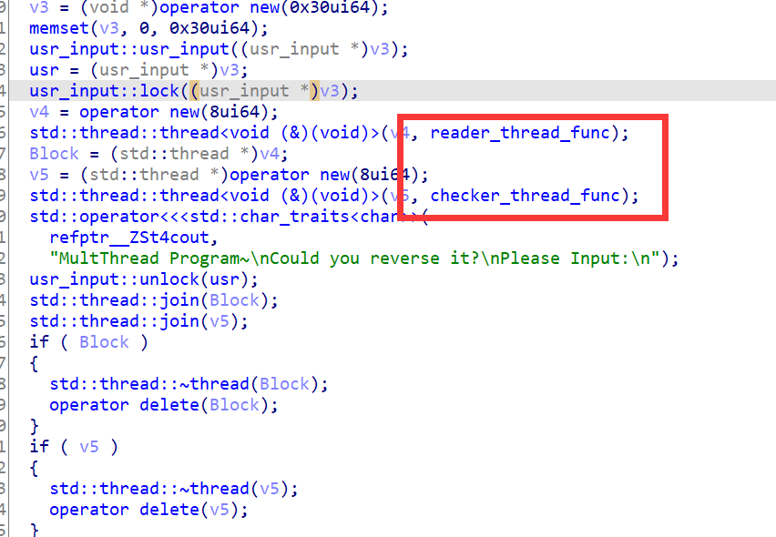
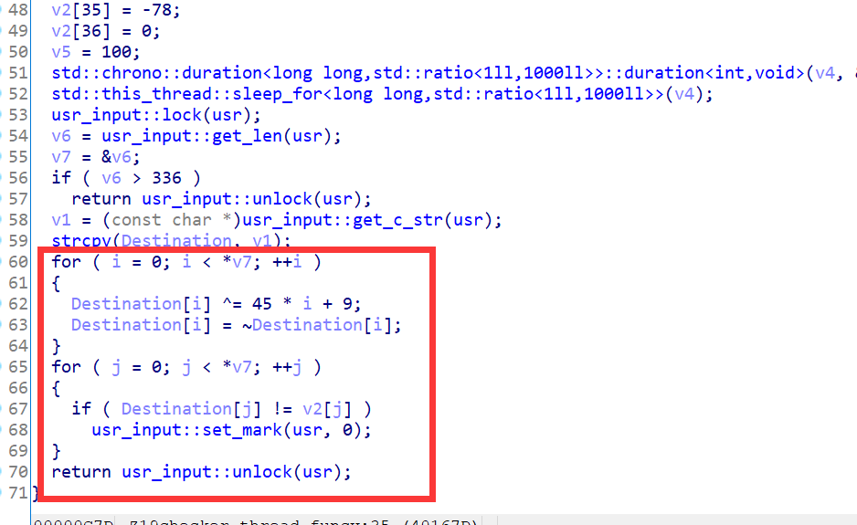

# Threads

`ACTF{mult_thread_is_hard_to_control}`

## 解题思路

C++写的程序。没有抹除符号表，但是反编译出来的东西对于低年级的同学而言应该比较生疏。

不过不要紧。慢慢看总能发现问题在哪里。

关键函数是图中红框这两个位置。reader线程负责读取，checker线程负责检查



点进checker，可以看到加密逻辑和加密后的数据。



点进reader，可以看到用户输入被读取的位置。篇幅限制，不放图了。

这道题静态分析难度低于调试。多线程调试对于新手而言比较困难。

## exp

```python
enc = [0xb7,0x8a,0xc8,0x29,0x39,0x78,0x9d,0xd7,0xfa,0x3e,0x40,0x6f,0xa8,0xc8,0xe1,0x37,0x79,0x90,0xbf,0xc0,0x1a,0x24,0x6a,0x8f,0xe1,0xe5,0x0b,0x68,0x69,0xb2,0xde,0xf7,0x24,0x46,0x90,0xb2]

for i in range(len(enc)):
    print(chr((~(enc[i]^((45*i+9)%0x100)))%0x100),end = '')
```

